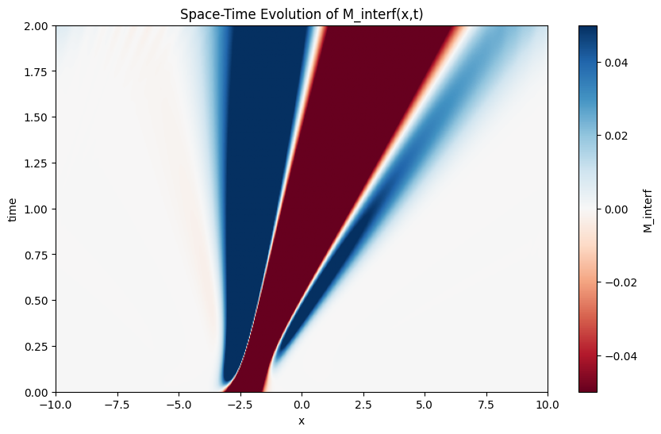

# Interference Cross-Term Extraction — "The Wobble Field"

This repository explores a measurable interference structure hidden in standard quantum mechanics. We isolate the cross-term:

\[
M_{\text{interf}} = |\psi_1 + \psi_2|^2 - (|\psi_1|^2 + |\psi_2|^2)
\]

and propose a field-based interpretation of this term — the **Wobble Field** — as a **real, local, dynamic structure** responsible for coherence in quantum interference.

---

## 🚀 What This Project Does

1. **Simulates** quantum interference using two evolving Gaussian wave packets.
2. **Extracts** the interference cross-term from the simulation.
3. **Applies** this framework to **real-world data** from a molecular-scale double-slit experiment (Zhou et al., 2021).
4. **Quantifies** the agreement between experimental and theoretical predictions.
5. **Analyzes** the cross-term in **Fourier space** to confirm structured modulation.
6. Proposes a **new frame**: interference is not just an effect — it is a field.

---

## 📊 Results Summary

| Metric | Value |
|--------|-------|
| Correlation (Exp vs Theory) | **0.95** |
| RMS Error (Normalized) | **0.83** |
| KL Divergence (MXT Prediction) | **0.30** |
| Fourier Match | **Yes** – same dominant spatial frequencies |

---

## 📁 Repo Structure
- ├── notebooks/wobble_field_analysis.ipynb ← Core simulation + data analysis
- ├── data/Data_D2He_DoubleSlitScattering.xlsx ← Zhou et al. 2021 experimental data
- ├── images/ ← Visualizations of the interference field
- └── README.md ← This file
---

## 🧠 Why This Matters

Most quantum simulations treat interference as a result — a pattern on a screen.  
This repo **isolates the dynamic cause** of interference: the cross-term itself.

We show that:
- This structure is **localized**, **time-evolving**, and **extractable**
- It shows up in real molecular scattering experiments
- It behaves like a **coherence field** — a “Wobble Field” — encoding the superposition’s dynamical structure

---

## 📎 Data Source

Experimental data from:

Zhou et al., 2021.  
[Quantum mechanical double slit for molecular scattering](https://zarelab.com/wp-content/uploads/2021/11/1066.pdf)  
DOI: [10.1126/sciadv.abj0853](https://doi.org/10.1126/sciadv.abj0853)

---

## 📈 Colab Notebook

Interactive notebook (original source):

🔗 [Colab notebook link](https://colab.research.google.com/drive/1wGAXh5HlW6W260zcMtwcYhQLk2WJzXtQ)

---

## ✍️ Interpretation

We propose:

- Interference isn’t just a pattern — it’s a **field**
- The cross-term \( M_{\text{interf}} \) can be extracted, visualized, and possibly controlled
- This structure reflects **coherence**, **phase relation**, and **quantum overlap** dynamically

---

## 📣 Call to Physicists, Mathematicians, and Explorers

This repo is the **first step** in a deeper inquiry.

- Can this cross-term be used to track decoherence?
- Can it predict or diagnose entanglement loss?
- Can it apply to BECs, photons, even neural coherence?

If you're a physicist, theorist, or someone serious about quantum structure:

> Open the code. Look at the data. Run the notebook.  
> See it for yourself.

Let’s make this structure visible.

---
## 🖼️ Visualization

*Space-time evolution of the interference cross-term M_interf(x, t). This field emerges from the difference between full superposition and individual probability densities. It’s dynamic, structured, and measurable.*

## 🧑‍🔬 License

MIT License — open, remixable, no restrictions. Use it to go further.
